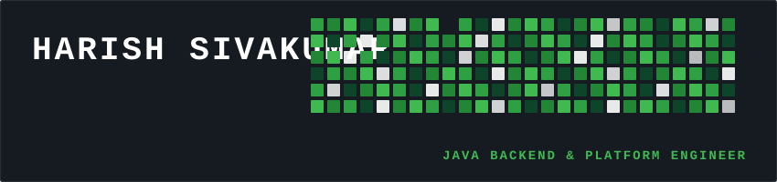

  

 

 

<!-- ==================== WHO I AM ==================== -->

  

<table>
  <tr>
    <td width="60%" valign="top">
      <h3>👋 Hi there! I'm Harish</h3>
      

        I am a 3rd-year <b>Electronics & Communication Engineering (ECE)</b> student focused on <b>Java Backend Engineering, Distributed Microservices, and Cloud Systems</b>.
      

      

        I specialize in designing and engineering high-concurrency RESTful microservices, event-driven messaging pipelines, robust relational/non-relational database architectures, and integrating modern <b>LLMs & Retrieval-Augmented Generation (RAG)</b> into Java applications.
      

      <ul>
        <li>🔭 <b>Currently Building:</b> Scalable microservices architectures & Spring AI powered systems.</li>
        <li>🌱 <b>Deepening Knowledge:</b> Distributed caching (Redis), message queues (Kafka), and container orchestration.</li>
        <li>⚡ <b>Core Philosophy:</b> Writing clean, self-documenting code, enforcing strict security (JWT/OAuth2), and optimizing system latency.</li>
      </ul>
    </td>
    <td width="40%" valign="top">
      

         
        
      

    </td>
  </tr>
</table>

 

<!-- ==================== TECH STACK & SKILL SET ==================== -->

  

### ⚙️ Core Backend & Frameworks

### 🛰️ Microservices & Distributed Messaging

### 🗄️ Databases & Vector Search

### 🐳 DevOps, Cloud & Infrastructure

### 🧠 AI Engineering & Embeddings

### 💻 Programming Languages

 

<!-- ==================== DSA & ALGORITHMS ==================== -->

  

<table>
  <thead>
    <tr>
      <th>Category</th>
      <th>Key Data Structures & Algorithmic Patterns</th>
      <th>Core Focus & Application</th>
    </tr>
  </thead>
  <tbody>
    <tr>
      <td><b>Linear & Array Patterns</b></td>
      <td><code>Arrays</code> • <code>Strings</code> • <code>Two Pointers</code> • <code>Sliding Window</code></td>
      <td>Sub-array optimization, memory efficiency, window expansion/contraction.</td>
    </tr>
    <tr>
      <td><b>Hashing & Searching</b></td>
      <td><code>HashMaps</code> • <code>HashSets</code> • <code>Frequency Counting</code></td>
      <td>O(1) lookups, caching strategies, duplicate tracking & set intersection.</td>
    </tr>
    <tr>
      <td><b>Non-Linear & Trees</b></td>
      <td><code>Binary Trees</code> • <code>BST</code> • <code>Level-Order Traversal</code></td>
      <td>Recursive traversals, depth/path evaluation, tree balance checking.</td>
    </tr>
    <tr>
      <td><b>Graph Algorithms</b></td>
      <td><code>Adjacency Lists</code> • <code>DFS</code> • <code>BFS</code></td>
      <td>Connected components, shortest path traversal, topological ordering.</td>
    </tr>
    <tr>
      <td><b>Recursion & Search</b></td>
      <td><code>Backtracking</code> • <code>State Search</code> • <code>Decision Trees</code></td>
      <td>Combinatorial generation, constraint propagation, decision space pruning.</td>
    </tr>
  </tbody>
</table>

 

<!-- ==================== FEATURED PROJECTS ==================== -->

  

<table>
  <tr>
    <td width="50%" valign="top">
      <h3>🎟️ Tick-It — Scalable Ticketing System</h3>
      
<i>Event-Driven Microservices Platform</i>

      <ul>
        <li>Architected distributed microservices using <b>Spring Boot</b>, <b>Eureka</b>, and <b>Spring Cloud Gateway</b>.</li>
        <li>Implemented <b>Redis distributed locking</b> & <b>Apache Kafka</b> event streams to process flash sale ticket reservations without race conditions.</li>
        <li>Secured with <b>JWT Stateless Authentication</b> & role-based authorization.</li>
      </ul>
      
<b>Tech:</b> Java, Spring Boot, Kafka, Redis, PostgreSQL, Docker, AWS EC2

    </td>
    <td width="50%" valign="top">
      <h3>🧠 Enterprise RAG Engine</h3>
      
<i>AI-Augmented Vector Search & Synthesizer</i>

      <ul>
        <li>Built an enterprise document ingestion pipeline using <b>Spring AI</b> and <b>Google Gemini API</b>.</li>
        <li>Generated high-dimensional vector embeddings and persisted in <b>PostgreSQL with pgvector</b>.</li>
        <li>Performed real-time cosine similarity search to retrieve relevant context for AI response generation.</li>
      </ul>
      
<b>Tech:</b> Spring AI, Gemini API, PostgreSQL, pgvector, Docker

    </td>
  </tr>
  <tr>
    <td width="50%" valign="top">
      <h3>🚀 SkillSprint — Developer Learning Hub</h3>
      
<i>Gamified Skill Building Platform</i>

      <ul>
        <li>Engineered RESTful APIs for course progression, quiz submission, and leaderboard ranking.</li>
        <li>Integrated <b>Spring Security & OAuth2 / JWT</b> for seamless multi-tenant authentication.</li>
        <li>Optimized database queries with <b>JPA / Hibernate</b> index tuning.</li>
      </ul>
      
<b>Tech:</b> Spring Boot, Spring Security, JWT, MySQL, Docker

    </td>
    <td width="50%" valign="top">
      <h3>🌱 EcoBites — Surplus Food Redistribution</h3>
      
<i>Real-Time Notification & Matching System</i>

      <ul>
        <li>Developed a real-time messaging system using <b>WebSockets (STOMP)</b> for instant alerts.</li>
        <li>Connected surplus food providers with local non-profits using geo-location matching.</li>
        <li>Deployed behind <b>Nginx reverse proxy</b> with SSL/TLS encryption.</li>
      </ul>
      
<b>Tech:</b> Spring Boot, WebSockets/STOMP, PostgreSQL, Nginx

    </td>
  </tr>
  <tr>
    <td colspan="2" width="100%" valign="top">
      <h3>🌐 Developer Portfolio — Interactive Web Platform</h3>
      
<i>High-Performance Interactive Showcase</i>

      <ul>
        <li>Designed a responsive portfolio showcasing microservice architecture diagrams, tech stack specs, and live project demos.</li>
        <li>Engineered high-fps 3D canvas visuals and responsive theme layout.</li>
      </ul>
      
<b>Tech:</b> JavaScript, HTML5, CSS3, WebGL, Responsive Design

    </td>
  </tr>
</table>

 

<!-- ==================== GITHUB STATS & METRICS ==================== -->

  
  

 

<!-- ==================== CONNECT & COLLABORATE ==================== -->

  

<b>I am actively seeking Java Backend Engineering, Systems, and Software Engineering Internships / Full-Time Roles. Let's connect!</b>

 

<table>
  <tr>
    <td align="center" width="20%">
      
    </td>
    <td align="center" width="20%">
      
    </td>
    <td align="center" width="20%">
      
    </td>
    <td align="center" width="20%">
      
    </td>
    <td align="center" width="20%">
      
    </td>
  </tr>
</table>

 

  

