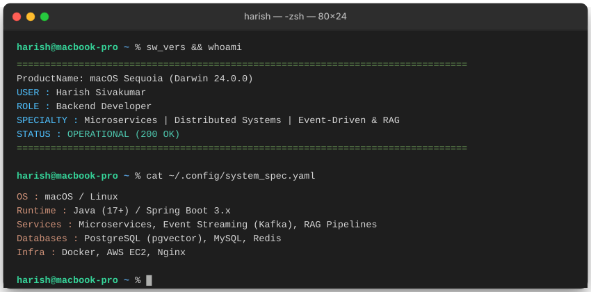
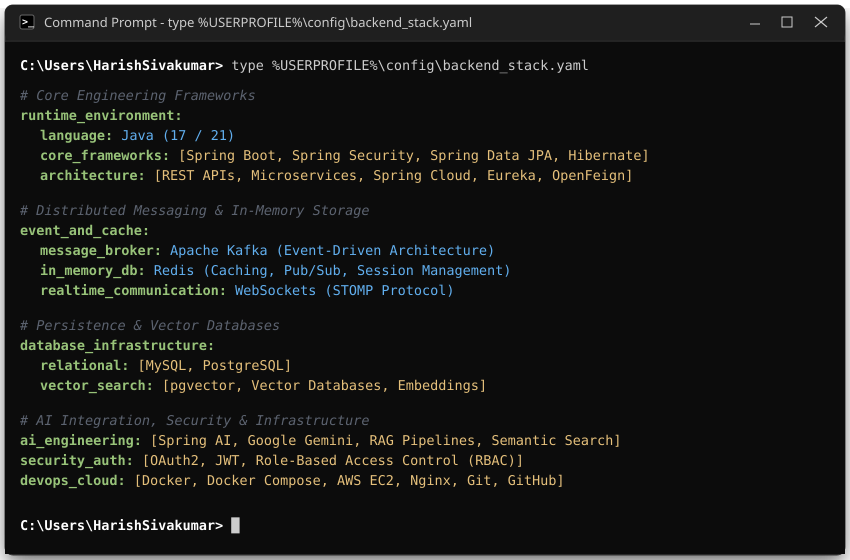
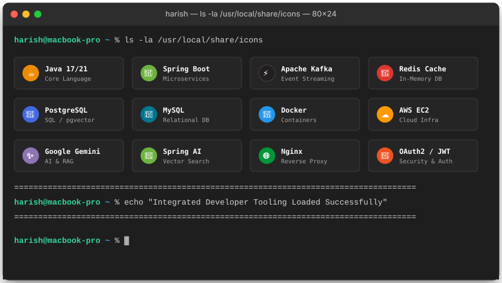
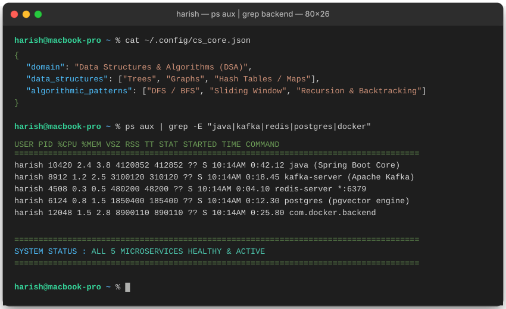
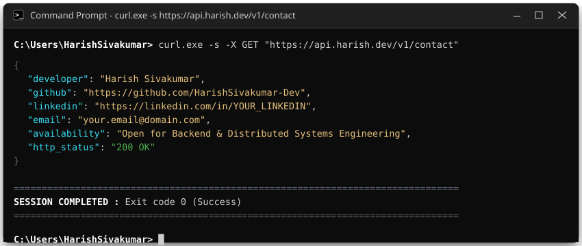

  <!-- 01 Header Terminal Card -->
  

    

  <!-- 02 Technical Stack Terminal Card -->
  

    

  <!-- 02b Visual Tech Icons Terminal Grid -->
  

 

### `> VISUAL TECH TOOLKIT`

  

 

#### Languages & Core Frameworks

  
  
  
  
  

#### Messaging, Storage & Databases

  
  
  
  
  

#### AI, Protocols & Security

  
  
  
  
  

#### Infrastructure & DevOps

  
  
  
  
  

 

  <!-- 03 CS & Process Terminal Card -->
  

    

  <!-- 04 Contact Terminal Card -->
  

    
  Built with terminal precision · Harish Sivakumar

