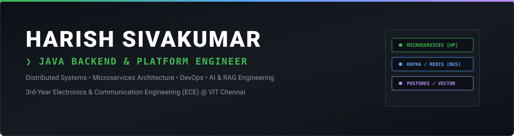
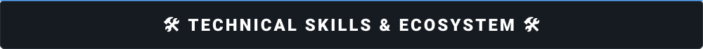

  

  

 

<table border="0" cellspacing="0" cellpadding="0">
  <tr>
    <td width="160" align="center">
      
    </td>
    <td align="center">
      <table border="0" cellspacing="0" cellpadding="8">
        <tr>
          <th>LinkedIn</th>
          <th>GitHub</th>
          <th>Gmail</th>
          <th>Portfolio</th>
          <th>LeetCode</th>
        </tr>
        <tr>
          <td align="center">   </td>
          <td align="center">   </td>
          <td align="center">   </td>
          <td align="center">   </td>
          <td align="center">   </td>
        </tr>
      </table>
    </td>
    <td width="160" align="center">
      
    </td>
  </tr>
</table>

 

  

  <table width="100%">
    <!-- ROW 1: Languages & Backend Core -->
    <tr>
      <td align="center" width="10%"> Java 21</td>
      <td align="center" width="10%"> Spring Boot</td>
      <td align="center" width="10%"> C++</td>
      <td align="center" width="10%"> C</td>
      <td align="center" width="10%"> Python</td>
      <td align="center" width="10%"> JavaScript</td>
      <td align="center" width="10%"> SQL</td>
      <td align="center" width="10%"> HTML5</td>
      <td align="center" width="10%"> CSS3</td>
      <td align="center" width="10%"> Git</td>
    </tr>
    <!-- ROW 2: Microservices, Distributed Systems & Messaging -->
    <tr>
      <td align="center"> Kafka</td>
      <td align="center"> Redis</td>
      <td align="center"> Spring Sec</td>
      <td align="center"> JWT / OAuth2</td>
      <td align="center"> JPA / Hib</td>
      <td align="center"> OpenFeign</td>
      <td align="center"> WebSockets</td>
      <td align="center"> Lua Scripts</td>
      <td align="center"> Config Server</td>
      <td align="center"> API Gateway</td>
    </tr>
    <!-- ROW 3: Databases, Cloud & Infrastructure -->
    <tr>
      <td align="center"> PostgreSQL</td>
      <td align="center"> MySQL</td>
      <td align="center"> pgvector</td>
      <td align="center"> Docker</td>
      <td align="center"> AWS EC2</td>
      <td align="center"> Nginx</td>
      <td align="center"> Linux</td>
      <td align="center"> Maven</td>
      <td align="center"> GitHub</td>
      <td align="center"> VS Code</td>
    </tr>
    <!-- ROW 4: AI / RAG & Algorithmic Paradigm -->
    <tr>
      <td align="center"> Spring AI</td>
      <td align="center"> Gemini API</td>
      <td align="center"> Embeddings</td>
      <td align="center"> Vector Search</td>
      <td align="center"> LeetCode 330+</td>
      <td align="center"> Arrays/Hash</td>
      <td align="center"> Trees/Graphs</td>
      <td align="center"> DFS / BFS</td>
      <td align="center"> Recursion</td>
      <td align="center"> Backtracking</td>
    </tr>
  </table>

 

  

  <table width="100%">
    <tr>
      <td width="50%" valign="top">
        <h3>🎟️ Tick-It</h3>
        
<b>Enterprise Microservices Ticket Management & Grievance Platform</b>

        <ul>
          <li>Spring Boot microservices with Eureka Service Discovery &amp; Spring Cloud Gateway.</li>
          <li>Redis distributed rate-limiting using Lua scripts &amp; session caching.</li>
          <li>JWT Stateless Auth &amp; Google OAuth2 with Role-Based Access Control (RBAC).</li>
          <li>Inter-service OpenFeign RPCs &amp; real-time STOMP WebSockets notification alert pipeline.</li>
        </ul>
        
<code>Spring Boot</code> • <code>Eureka</code> • <code>Gateway</code> • <code>JWT</code> • <code>Redis</code> • <code>Kafka</code> • <code>OpenFeign</code>

      </td>
      <td width="50%" valign="top">
        <h3>🚀 SkillSprint</h3>
        
<b>Enterprise Corporate Learning &amp; Certification Backend</b>

        <ul>
          <li>Backend engine for multi-tenant course management, progress tracking &amp; certificates.</li>
          <li>Relational schema optimization in MySQL with Redis query caching &amp; background cron jobs.</li>
          <li>Containerized architecture using Docker &amp; Docker Compose.</li>
        </ul>
        
<code>Spring Boot</code> • <code>MySQL</code> • <code>Redis</code> • <code>Docker</code> • <code>RBAC</code> • <code>Scheduled Jobs</code>

      </td>
    </tr>
    <tr>
      <td width="50%" valign="top">
        <h3>🧠 Enterprise RAG Engine</h3>
        
<b>AI-Augmented Contextual Retrieval Pipeline</b>

        <ul>
          <li>Document ingestion pipeline using Spring AI &amp; Google Gemini API.</li>
          <li>Vector embedding storage in PostgreSQL with pgvector cosine similarity search.</li>
        </ul>
        
<code>Spring AI</code> • <code>Google Gemini</code> • <code>PostgreSQL</code> • <code>pgvector</code> • <code>Embeddings</code>

      </td>
      <td width="50%" valign="top">
        <h3>🌱 EcoBites</h3>
        
<b>Hackathon-Winning Surplus Food Redistribution Backend 🏆</b>

        <ul>
          <li>High-efficiency REST API backend mapping food donors to shelters.</li>
          <li>Optimized spatial query persistence layer using Spring Data JPA &amp; MySQL.</li>
        </ul>
        
<code>Spring Boot</code> • <code>Spring Data JPA</code> • <code>MySQL</code> • <code>REST APIs</code>

      </td>
    </tr>
  </table>

 

  

 

  

  
  

 

  <picture>
    <source media="(prefers-color-scheme: dark)" srcset="https://raw.githubusercontent.com/HarishSivakumar-dev/HarishSivakumar-dev/output/github-contribution-grid-snake-dark.svg">
    <source media="(prefers-color-scheme: light)" srcset="https://raw.githubusercontent.com/HarishSivakumar-dev/HarishSivakumar-dev/output/github-contribution-grid-snake.svg">
    
  </picture>

 

  <h3>🏆 Recognized Achievements</h3>
  
🥇 <b>Hackathon Winner</b> — EcoBites Project | 📄 <b>Best Paper Award</b> — ICAME 2026 Conference | 🎙️ <b>Presented</b> @ ICAME 2026 
  🎖️ <b>Recognition</b> — VIT Chennai AI Club 24-Hour Hackathon | 🎓 <b>McKinsey Forward</b> — 2026 Cohort

   
  

