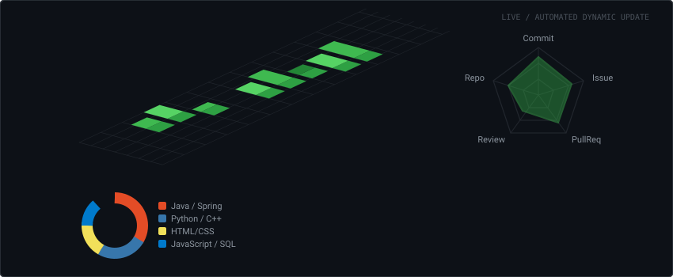

  

 

<!-- ==================== WHO I AM / WHAT I DO / VISION / BEYOND CODE ==================== -->
<table>
  <tr>
    <td bgcolor="#0d1117">
       
      
      

        Hey, I'm Harish – a 3rd-year ECE student &amp; Java backend engineer passionate about building high-throughput microservices, distributed platform systems, and AI-powered backends. I work at the intersection of Java, Spring Boot, cloud infrastructure, and distributed data pipelines.
      

       
      
      

        I build software and AI-powered tools that solve real problems – and I can't stop. Focused on designing low-latency event ticketing microservices (Tick-It), real-time food redistribution networks (EcoBites), Spring AI RAG engines, and understanding everything from first principles.
      

       
      
      

        My goal is to engineer fault-tolerant, scalable, and resilient backend infrastructure. I want to build platform tools that genuinely make technology work for humans – pushing high-concurrency systems further ahead than yesterday.
      

       
      
      

        Data Structures &amp; Algorithms, exploring distributed system design, tinkering with vector databases &amp; LLM embeddings, and continuous learning – that's me outside of code.
      

       
    </td>
  </tr>
</table>

 

<!-- ==================== CONNECT TABLE ==================== -->

  <table>
    <thead>
      <tr>
        <th align="center">Linkedin</th>
        <th align="center">X (Twitter)</th>
        <th align="center">Gmail</th>
        <th align="center">Website</th>
        <th align="center">LeetCode</th>
        <th align="center">GitHub</th>
      </tr>
    </thead>
    <tbody>
      <tr>
        <td align="center">
          
        </td>
        <td align="center">
          
        </td>
        <td align="center">
          
        </td>
        <td align="center">
          
        </td>
        <td align="center">
          
        </td>
        <td align="center">
          
        </td>
      </tr>
    </tbody>
  </table>

 

<!-- ==================== 3D CONTRIBUTION & METRICS GRAPH ==================== -->

  

 

<!-- ==================== SKILL SET ==================== -->

  

 

  

