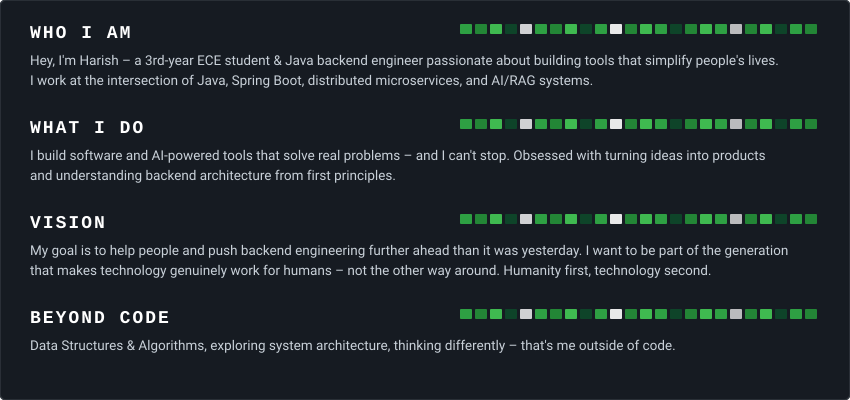
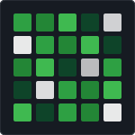
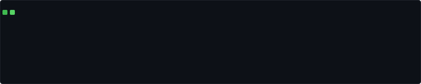

  

  

 

<table border="0" cellspacing="0" cellpadding="0">
  <tr>
    <td width="200" align="center">
      
    </td>
    <td align="center">
      <table border="0" cellspacing="0" cellpadding="8">
        <tr>
          <th>Linkedin</th>
          <th>X (Twitter)</th>
          <th>Gmail</th>
          <th>Website</th>
          <th>LeetCode</th>
          <th>GitHub</th>
        </tr>
        <tr>
          <td align="center">   </td>
          <td align="center">   </td>
          <td align="center">   </td>
          <td align="center">   </td>
          <td align="center">   </td>
          <td align="center">   </td>
        </tr>
      </table>
    </td>
    <td width="200" align="center">
      
    </td>
  </tr>
</table>

  

  <table width="100%">
    <!-- ROW 1: Core Web & Languages -->
    <tr>
      <td align="center" width="10%"> Java</td>
      <td align="center" width="10%"> Spring</td>
      <td align="center" width="10%"> Postgres</td>
      <td align="center" width="10%"> MySQL</td>
      <td align="center" width="10%"> Redis</td>
      <td align="center" width="10%"> Kafka</td>
      <td align="center" width="10%"> Docker</td>
      <td align="center" width="10%"> AWS</td>
      <td align="center" width="10%"> Nginx</td>
      <td align="center" width="10%"> Git</td>
    </tr>
    <!-- ROW 2: Tools & AI -->
    <tr>
      <td align="center"> Maven</td>
      <td align="center"> C++</td>
      <td align="center"> C</td>
      <td align="center"> Python</td>
      <td align="center"> JS</td>
      <td align="center"> HTML</td>
      <td align="center"> CSS</td>
      <td align="center"> Gemini</td>
      <td align="center"> Postman</td>
      <td align="center"> VS Code</td>
    </tr>
  </table>

 

<picture>
  <source media="(prefers-color-scheme: dark)" srcset="output/github-contribution-grid-snake-dark.svg">
  <source media="(prefers-color-scheme: light)" srcset="output/github-contribution-grid-snake.svg">
  
</picture>
