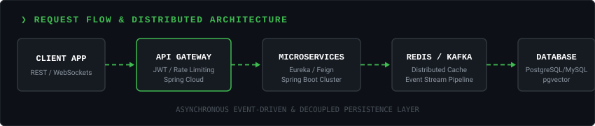

<div align="center">
  
</div>

<br/>

<div align="center">

[](https://github.com/HarishSivakumar-dev)
[](https://github.com/HarishSivakumar-dev)
[](https://linkedin.com/in/)
[](mailto:harishsivakumar.dev@gmail.com)

</div>

<br/>

```bash
[harish@platform-node-01 ~]$ neofetch --engineer

       _  _  _    _  ____  ___ _  _         harish@platform-node-01
      | || |/ \  | |/ ___|/ _ \ || |        -----------------------
      | __ / _ \ | | \___ \ | | | || |_     OS        : Enterprise Linux x86_64
      |_||_/_/ \_\|_|\____/\_/ \_|_  _|     Host      : Java 21 LTS / Spring Boot 3
                                            Uptime    : 3rd-Year ECE @ VIT Chennai
                                            Kernel    : Distributed Systems & Platform Infrastructure

[+] Core Stack      : Java, C, C++, Python, JavaScript, SQL, HTML5, CSS3
[+] Backend         : Spring Boot 3, Spring Security, JWT, OAuth2, JPA, OpenFeign, REST APIs
[+] Microservices   : Eureka, Spring Cloud Config, API Gateway, Resilience4j
[+] Distributed     : Apache Kafka, Redis (Caching & Rate Limiting), WebSockets (STOMP)
[+] Databases       : PostgreSQL, MySQL, pgvector (Vector Similarity Search)
[+] Cloud / DevOps  : Docker, Docker Compose, AWS EC2, Nginx, Linux, Git, Maven
[+] AI / RAG        : Spring AI, Google Gemini API, Embeddings, Vector Search
[+] Algorithmic     : 330+ LeetCode Solved (Arrays, Graphs, Trees, DFS/BFS, Window)
```

<br/>

```bash
[harish@platform-node-01 ~]$ traceroute -v gateway.harish.dev
```

<div align="center">
  
</div>

<br/>

```bash
[harish@platform-node-01 ~]$ kubectl get microservices -n production

SERVICE            STACK                           PURPOSE
----------------   -----------------------------   -------------------------------------------------
backend-core       Spring Boot 3, Security, JWT    High-throughput RESTful services & RBAC auth
discovery-gateway  Eureka, Spring Cloud Gateway    Service discovery, centralized routing & filtering
event-pipeline     Apache Kafka, WebSockets        Asynchronous event queues & real-time alerts
cache-rate-limiter Redis Cluster, Lua Scripts        Atomic rate-limiting & low-latency query cache
vector-search-rag  Spring AI, PostgreSQL + pgvector RAG ingestion & high-dimensional vector search
cloud-infra        Docker, AWS EC2, Nginx          Container deployment & reverse proxying
```

<br/>

```bash
[harish@platform-node-01 ~]$ ./deployments.sh --list
```

### 🎟️ TICK-IT — Microservices Ticketing Platform
> `Spring Boot` • `Eureka` • `API Gateway` • `JWT/OAuth2` • `Redis` • `Kafka` • `OpenFeign` • `WebSockets`
- Distributed Spring Boot microservices with Eureka discovery and Spring Cloud Gateway routing.
- Redis-based atomic rate-limiting with Lua scripts and distributed session caching.
- Secured with JWT & Google OAuth2; inter-service RPC via OpenFeign and STOMP WebSockets.

---

### 🚀 SKILLSPRINT — Corporate Learning & Certification Engine
> `Spring Boot` • `MySQL` • `Redis` • `Docker` • `RBAC` • `Cron Jobs`
- Multi-tenant course & certification backend with Redis caching and MySQL schema optimization.
- Automated background scheduled jobs; containerized with Docker & Docker Compose.

---

### 🧠 ENTERPRISE RAG ENGINE — Contextual Retrieval Pipeline
> `Spring AI` • `Google Gemini` • `PostgreSQL` • `pgvector`
- Ingestion pipeline parsing context with Spring AI & Google Gemini API.
- High-dimensional vector embeddings stored in PostgreSQL with pgvector cosine similarity search.

---

### 🌱 ECOBITES — Food Surplus Redistribution Backend
> `Spring Boot` • `Spring Data JPA` • `MySQL` • `REST APIs` • **Hackathon Winner 🏆**
- High-efficiency logistics backend routing surplus food providers to shelters.

---

### 🌐 DEVELOPER PORTFOLIO PLATFORM
> `JavaScript` • `WebGL` • `HTML5 / CSS3` • `Mail Dispatcher`
- Personal interactive platform featuring WebGL graphics and a backend mail dispatch pipeline.

<br/>

```bash
[harish@platform-node-01 ~]$ ./leetcode_stats --summary

[OK] Total Solved: 330+ LeetCode Problems
[OK] Core Focus  : Arrays, Hashing, Sliding Window, Two Pointers, Trees, Graphs, DFS, BFS, Backtracking
```

<br/>

```bash
[harish@platform-node-01 ~]$ cat /var/log/achievements.log

[2026-03] [WINNER] EcoBites Project — Hackathon Winner 🏆
[2026-02] [AWARD ] Best Paper Award — ICAME 2026 Conference 📄
[2026-02] [TALK  ] Paper Accepted & Presented — ICAME 2026 🎙️
[2026-01] [HONOR ] Recognition — VIT Chennai AI Club 24h Hackathon 🎖️
[2026-01] [COHORT] McKinsey Forward 2026 Cohort 🎓
```

<br/>

```bash
[harish@platform-node-01 ~]$ cat /etc/philosophy.conf

[1] Build systems, not just APIs.
[2] Understand what happens behind the abstraction.
[3] Design for scalability, reliability, and maintainability.
[4] Learn by building production-style systems.
```

<br/>

```bash
[harish@platform-node-01 ~]$ htop --filter github-metrics
```

<div align="center">
  
  
</div>

<br/>

```bash
[harish@platform-node-01 ~]$ tail -f /var/log/contributions.log
```

<div align="center">
  <picture>
    <source media="(prefers-color-scheme: dark)" srcset="https://raw.githubusercontent.com/HarishSivakumar-dev/HarishSivakumar-dev/output/github-contribution-grid-snake-dark.svg">
    <source media="(prefers-color-scheme: light)" srcset="https://raw.githubusercontent.com/HarishSivakumar-dev/HarishSivakumar-dev/output/github-contribution-grid-snake.svg">
    
  </picture>
</div>

<br/>

```bash
[harish@platform-node-01 ~]$ ssh connection_request --user=recruiter
```

<div align="center">
  <p font-size="14px"><b>Seeking Java Backend, Systems &amp; Platform Engineering Roles.</b></p>
  <br/>
  <a href="mailto:harishsivakumar.dev@gmail.com">
    
  </a>
  <a href="https://linkedin.com/in/">
    
  </a>
</div>
